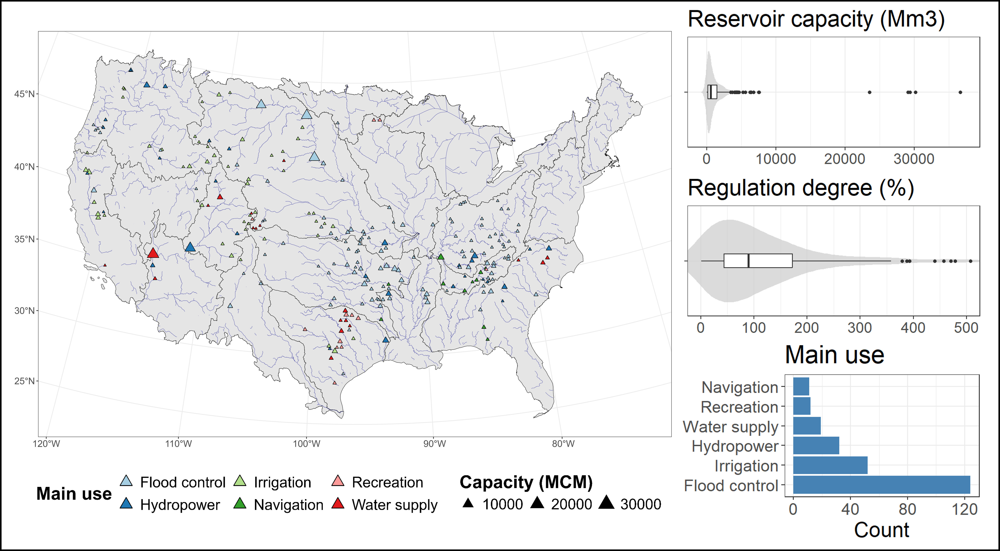
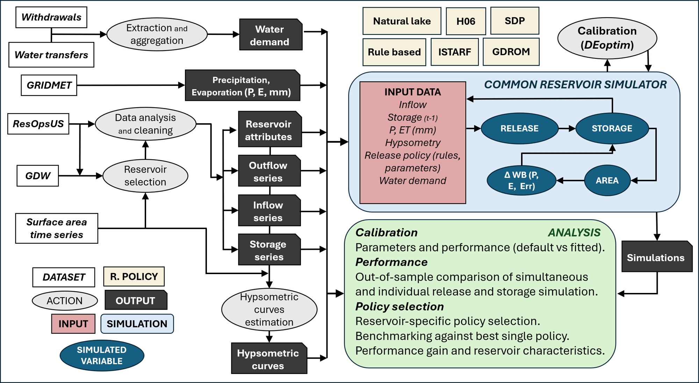

# Readme file

Accompanying repository to the manuscript *Benchmarking Reservoir Release Policies Across CONUS: The Impact of Model Structure and Parameter Calibration*, submitted to Water Resources Research Journal.

Authors: Alejandro Sánchez-Gómez, Stefano Galelli, Hisham Eldardiry, Jon Herman.

This repository contains data and code necessary to run the release policies implemented. 

See repository structure description for more information. 

Further data may be available under request.

### Structure

The repository contains three folders.

#### data

- **Processed data:** Contains all the observed/inferred time series used as inputs for the simulations and calibration. These files were generated using the `time_series_cleaning.R` file. Input files used to run the script were directly downloaded from the source datasets (ResOpsUS, GRSAD, GDW).

- **Release policies:** Contains the performance achieved for all the reservoirs for every release policy implemented. Simulations were not included because its size. Contact repository owner for more information.

#### scripts

Contains the main scripts used for the workflow.

- `time_series_cleaning.R`, as described above, was used to generate simulation input files.

- All scripts named `rp_*.R` implements one different release policy. The common and specific simulation functions are defined within. The code allow to run simulations for an example reservoir, to perform parameter calibration, and to compare default and fitted hydrograph and performance.

- `*.py` scripts were used to perform the GDROM fitting step.

#### figures

Figures generated during the time series cleaning process (clean IOS, hypsometric curves, and water balance evaluation) are available for every reservoir in the `time_series_figs` folder.

Best simulation achieved for each reservoir (simulated vs observed release and storage time series and performance), are available in the `release_policies` folder. Further figures (all reservoirs and all methods) are available under request.
